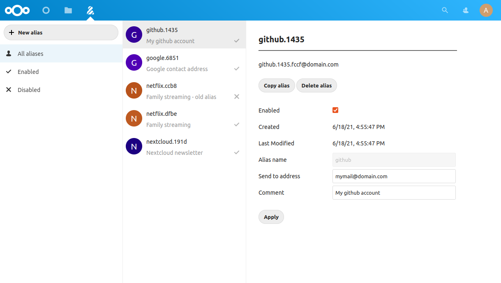
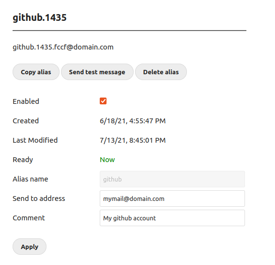
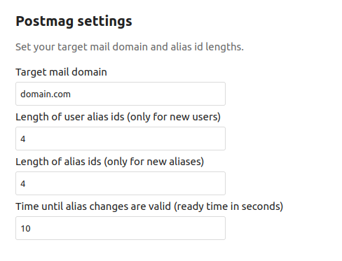

# Postfix mail alias generator for Nextcloud

Postmag allows users to generate aliases for their email addresses so that they can use different email addresses for different services on the internet easily.

A configuration file for postfix that implements these aliases can be generated via the occ command line tool.

**One remark**: This app needs admin access to a postfix mail server for your own domain and some admin skills (for instance for deploying the generated alias file to the mail server). Otherwise it is only a list of a bunch of text without any usage.



## Alias format

A generated alias is built out of 3 parts.

* alias_name: The user can choose an alias name to make it more easy for the user to identify the alias. It is recommended to use the name of the service where the alias will be used to identify compromised services if you receive spam via this alias. For instance use the alias_name "amazon" if you want to use the Alias for your Amazon account.
* alias_id: A random hexadecimal identifier is generated by Postmag. If the user thinks, that the alias is contained in a public email database in the internet, the user can lock this alias and generate a new one with the same alias_name. The new alias will have a new alias_id and can be replaced in the compromised service.
* user_alias_id: Every Nextcloud user will have an own random hexadecimal user_alias_id, that stays the same for every alias of the user. This way, there can be no alias conflicts between different users.

Every alias will be of the format

```
alias_name.alias_id.user_alias_id@your_domain.com
```

your_domain.com is configurable by the administrator.

## Alias form

Postmag gives the users of your Nextcloud instance an easy form to create aliases of your domain.



* Copy alias: Copies the current alias to clipboard.
* Send test message: Send a test mail to the current alias.
* Delete alias: Delete this alias. Deleted aliases can not be restored and thus not be activated again. Consider disabling aliases if you don't want to receive messages via this alias anymore.
* Enabled: If the alias is enabled, the user receives mails via it.
* Created: Timestamp of creation of this alias.
* Last Modified: Timestamp of last modification.
* Ready: Shows the user, if the set settings of this alias are already valid. See "Time until alias changes are valid" in the settings section below for more information.
* Alias name: The alias_name part of the alias. This can be chosen by the user at the creation of the alias, but it can't be changed afterwards.
* Send to address: The target mail address of this alias.
* Comment: A comment that the user can choose for further information. This has no technical purpose, it's just an information for the user.

## App settings

Postmag gives the admin of your Nextcloud instance some options to configure the app. You find the settings in the "Additional settings" section of Nextcloud.



* Target mail domain: This is your domain for which the users can generate aliases. It is the your_domain.com part of the aliases.
* Length of the user alias ids: Length of the user_alias_id part of the aliases. This affects only new users of your instance. The user_alias_id part never changes for existing users. But if your instance grows you can increase this value if you like.
* Length of alias ids: Length of the alias_id part of the aliases. This affects only new aliases of the users. Existing aliases never changes.
* Time until alias changes are valid: This setting is useful if you pull the postmag:aliases command (see below) in regular intervals to update your mail server config (for instance via a crontab trigger). You can than make the time until the next trigger visible to the user. For doing this, set the time interval here in seconds. If you don't need this feature, just set this setting to 0.

## OCC Commands

The app implements 2 OCC commands.

### postmag:last_modified

This command writes the timestamp of the last alias change to the console. Everytime a user updates or creates an alias this timestamp will change. You can use it to check if you have populated the most recent alias file to your postfix server.

If you use this command with the option "-f" you get the timestamp formatted in a more readable format than in unix time.

### postmag:aliases

This command generates an alias file out of the enabled user aliases an writes it to the console. You can use this file directly with you postfix server (don't forget to call newaliases on you postfix server).

The aliases will be of the format described above.

## Disclaimer

I've written this app because I needed it for my own Nextcloud instance. Feel free to use it for your Nextcloud and however you want under the terms of AGPL (see COPYING).

I'm happy if you open an issue for a bug report or a feature request, but please don't be surprised if I don't reply to these tickets immediately, since I develop the app in my free time. Of course if you want to speed up development, please fork the app and open a pull request.

## Translations

If you want to see Postmag in you language, I'd be very happy if you contribute a translation.

Just fork the app and use [postmag.pot](translationfiles/templates/postmag.pot) with your favorite translation editor (for instance [poedit](https://poedit.net/)).
Please open a pull request when you are done.

More details on how to translate Nextcloud apps can be found [here](https://docs.nextcloud.com/server/latest/developer_manual/basics/front-end/l10n.html#manual-translation).
